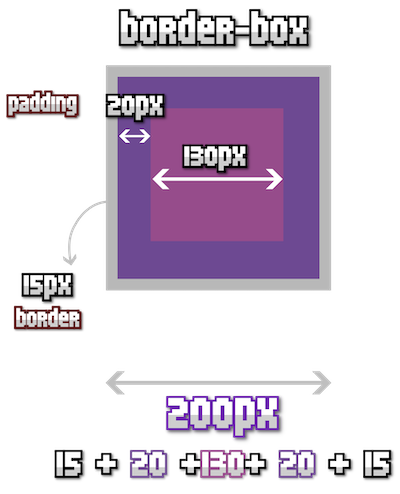
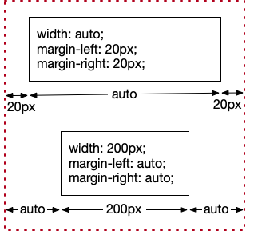

# Project 2

This website is available at:
https://MY_USER_NAME.github.io/project2

**Before working on this project:**

1. In your web browser, **make a web server for your project** by forking the project and turning on GitHub “Pages”:
   1. Clone (make an exact copy of) this project by clicking the “Fork” button. And then the “Create fork” button.

   2. After the fork is finished, click the “settings” tab.

   3. On the left side, click the “Pages” link.

   4. Under the “Branch” heading, change “None” to “main”.

   5. Click the “Save” button.

   6. Click the “Code” tab on the top left side.

2. **Clone the project to your laptop.**
   1. In VS Code, choose “File” → “New Window”.

   2. In the “Welcome” tab, choose “Clone Git Repository…”. (If you don’t have a “Welcome” tab, from the drop-down menus, choose “Help” → “Welcome”. Then make sure the “Show welcome page on startup” option is checked.)

   3. At the top of the VS Code window, click “Clone from GitHub” and choose the option that is “your_username/project2”.

   4. Find your Documents → School → Code folder and choose “Select as Repository Destination”.

   5. When asked “Would you like to open the repository?”, choose “Open”

   6. You should see a prompt that says “This folder contains a workspace file 'project2.code-workspace'. Do you want to open it?” Click the “Open Workspace” button.

3. **Change the URL at the top of this file.**
   1. Open the `README.md` file.

   2. Replace `MY_USER_NAME` with your GitHub username; for example: `johnalbin`.

   3. Save this file!

## Notes

**When helping a classmate:**

1. Don’t do the fix for them. (Don’t act like an AI that washes their clothes.)

2. **_Let them do the fix_**. Let the person being helped do all the typing and clicking.

3. Tell them _what_ to do.

4. Also, tell them _why_ it was broken or _why_ your fix works.

**Preview this file (instead of looking at its code):**

1. If the “README.md” tab above is in _italics_, open the `…` menu to the tab’s right and un-check the “Enable Preview Editors” option.

2. If you don’t have a “Welcome” tab, from the drop-down menus, choose “Help” → “Welcome”. Then make sure the “Show welcome page on startup” option is checked.

3. Right-click (or two-finger click) on the “README.md” tab above and choose “Open Preview”.

4. Right-click on the “Preview README.md” tab above and choose “Split & Move” → “Move Right”.

5. Close the “README.md” tab on the left. (Don’t close the “Preview” tab.)

## Project Instructions: Part 1

**🙋🏻 Don’t forget: you can ask questions at anytime! That’s how you learn. 🧠🧐**

1. Create a new `index.html` file.

2. **Add boilerplate HTML** markup to the file.
   1. You should add the following HTML elements:
      - <!doctype html>
      - html
      - head
        - title
      - body
        - header
          - div
            - div
              - img
              - b
            - menu
              - a
              - button
        - main
          - h1
        - footer
          - div
            - p
        - script

      > Be sure to use closing tags when needed. Be sure to nest elements correctly. (“nest” means to put one thing inside another.)

      We are using 5 new HTML elements:
      - `menu` A list of links that are a **menu** of choices for _page navigation_. (_navigate_ means to move around inside something with a plan or purpose. You can navigate the ocean, navigate a website, or navigate a city.)
      - `main` Everything inside this element is the page’s **main** content (the most important information).
      - `header` Just like the page has a `footer`, it can also have a **header**. We usually put the website name and the website navigation inside the `header`.
      - `div` A content **division**. A generic box with no default styles. (Compare with the `p` element which has margins by default.) Inside the `body` element, a `div` can contain any other HTML element.
      - `b` Makes text **bold**.

   2. Inside the `title` and `h1` elements, add the text: `Project 2: A Clean Slate`

   3. Inside the `b` element, add your name.

   4. For the `img` element, use the `avatar.png` file that is in your project’s `images` folder.

   5. Inside the `a` link element in the `menu`, add the name of your previous project (week1 or week2). And add the URL to the website for that project as an attribute on the `a` element.

      > Do you remember what attribute to use on the link element? If you don’t remember, look at your last project or ask for help.

      > What’s the URL for your first project’s website? \_Hint: it’s the same as the URL at the top of this file, but with `project2` replaced with the name of your first project.

   6. Inside the `button` element in the `menu`, add the text: `Light mode`. Give that button an `id` attribute of `color-mode-button`.

   7. Inside the footer’s `p` element, add today’s date.

   8. We will leave the `script` element empty for now.

3. **Add some content** to the page.
   1. Just underneath the `h1`, copy and paste the following HTML:

      ```html
      <p>
        How do we center the content in our browser window? How wide should our
        content be? How wide should our content be if we look at our webpage on
        a phone’s browser?
      </p>
      <h2><i>A poem</i></h2>
      <p>
        A website is a work of art<br />
        A poem for the digital age<br />
        Built with skill and heart<br />
        To inspire while filling the page
      </p>
      ```

      > What new HTML elements did we use above? Test it in your web browser.
      >
      > - Do you think you know what the “br” stands for? Hint: “line br…”
      > - What do you think the `i` element stands for?

   2. Have a teacher review your work so far.

   3. Save your file. Then use Git to add your changes and make a commit. You can choose your own commit message.

4. **Add page styles.**
   1. Create a `styles` folder and then create a `page.css` file inside `styles`.

   2. Add the following CSS:

      ```css
      * {
        box-sizing: border-box;
      }
      body {
        padding: 20px;
        /* TODO Add dark mode styles here. */
      }

      .light-mode {
        /* TODO Add light mode styles here. */
      }

      .center {
        width: 940px;
        padding: 20px;
        border: 1px dotted white;
        /* TODO Add margins to center. */
      }
      .poem {
        text-align: center;
      }

      footer {
        /* TODO Add styles */
      }

      .light-mode footer {
        /* TODO Add footer light mode styles here. */
      }
      ```

      > You can copy and paste the CSS above.

   3. Add a dark background and light text to our page.css using the **element selector**: `body`

   4. Add a `<link>` on our `index.html` file that will load our `page.css` styles.

      > Where does the `link` element go in our HTML file?

   5. Find the `p` after our `A poem` heading. Add a `class` attribute set to `poem`.

      > Notice how the styling of the poem changes. What CSS property made that change?

   6. Add a background color to the `footer` element.

   7. Add light mode styles to the `page.css` file. When we write the JavaScript later, the `light-mode` class will be added to the `body`.

      > Notice we have this rule: `.light-mode {}` This allows us to write light mode styles in the same file as our default dark mode styles.

      > We also have a `.light-mode footer {}` rule. This allows us to change the light mode styling of `<footer>` right next its dark mode styling.

5. Learn about CSS’s **box model**:
   1. Here’s a diagram showing `margin`, `border`, and `padding` CSS properties.

      

      If you only want to change the margin, border or padding of one side of the box, you can use one of these properties:
      - `margin-top`, `margin-bottom`, `margin-left`, `margin-right`
      - `border-top`, `border-bottom`, `border-left`, `border-right`
      - `padding-top`, `padding-bottom`, `padding-left`, `padding-right`

   2. Next is a diagram showing what happens when you set `width` to a specific length, like this:

      ```css
      .example {
        border: 15px solid grey;
        padding: 20px;
        width: 200px;
      }
      ```

      

      The above diagrams show CSS’s “**box model**”. The _element’s box_ is defined with a `width` or `height`. The `border` is the edge of the box and its `padding` is the spacing between the border and the content. The `margin` is the spacing on the outside of the box.

      > In the example above, the width of the box is `200px`. Since the border is `15px` thick and the padding is `20px` thick, the space left for the content of the box is `130px`. _How was that calculated? Don’t forget that there are borders and padding on the left and the right._

   3. If the `width` is `auto` (the default), the box width will take up all remaining space inside the window. If the `width` is set to a specific length (like `200px`), you can set the `margin-left` and `margin-right` to `auto` and the two margins will split the remaining space equally. This will center the box in the window.

      

   4. Open our `index.html`. Add a `center` **class attribute** to `div` element inside the `footer` element.

   5. Open our `page.css` file. Edit the `.center` rule so that the box is centered. _Hint: what properties do we need to add to that rule? Re-read step C above._

6. **Add color mode JavaScript.**
   1. Create a `scripts` folder and then create a `color-mode.js` file inside `scripts`.

   2. In the `index.html` file, add a `class` attribute to the `body` element using the value of `dark-mode`.

      > _Why did we use a `class` instead of an `id` like last time? Is “Dark mode” an unique name (`id`) or a category (`class`)? What do you think?_

   3. In the `index.html` file, edit the `script` element by adding a `src` attribute that points at our new `color-mode.js`

   4. **Write the JavaScript to toggle color modes.** We will be writing all this JavaScript inside the `color-mode.js` file.
      1. Find the color button using `document.getElementById()`; the first parameter will be the `id` attribute on the `<button>`. Save the button element found to a variable named `button`.

      2. Define a function named `toggleColorMode`
         - It will have one _parameter_; name the parameter `event`.
         - Write `if`/`else` blocks that test if the `document.body.classList` object contains `dark-mode`.

           > The `classList` object has a `contains()` function that can test if a class is in the class list.

         - In the `if` block:
           - Set the button’s text to “Dark mode” using: `button.textContent = "Dark mode";`
           - Replace the `body` element’s `dark-mode` class with `light-mode`.

             > The `classList` object has a `replace("old", "new")` function that can replace an old class with a new class. That function has two parameters; the first is the old class to be removed and the second is the new class to be added.

         - In the `else` block, do the opposite as the `if` block.

         - After the `if`/`else` blocks, add this:
           ```javascript
           console.log("event =", event);
           ```

      3. Tell the `button` to use the `toggleColorMode` function when it is clicked.
         - We won’t be using HTML to do this. Last time we used the `onClick` attribute on `<button>`.

         - We will be using JavaScript to add a function that is run when the button’s click event happens.

           In our `color-mode.js` file, we will use the `addEventListener("click", nameOfFunction)` function that is on every `HTMLElement` object.

           Use this JavaScript:

           ```javascript
           // Run our function when the button is clicked.
           button.addEventListener("click", toggleColorMode);
           ```

## Bonus features

If you have extra time, you should try out these other CSS properties.

1. **Add some fonts!**
   1. Look at the [Google Fonts website](https://fonts.google.com/?lang=en_Latn&preview.text=Hello,%205IN%20students!%20Check%20out%20these%20fonts…).
      1. Look at the filters on the left side, especially the “Feeling”, “Appearance”, and “Seasonal” filters.

      2. When you find a font, click on it.

      3. Then click on the “Get font” button.

      4. Then click on the “Get embed code” button.

   2. Copy the code under “Embed code in the `<head>` of your html” and put it in your `index.html` file.

   3. Under the “CSS class”, copy the `font-family` line and put it in your `page.css`’s `h1` rule.

   4. Find another font and add to your CSS as above. This time add the `font-family` line to your `body` rule.

2. **Learn about `border-radius`!**

   Add a `background-color` and `color` to your button. Then add `border-radius: 5px;` to your button.

   > What happens when you use `border-radius: 50%`? Fifty percent of what? (It's fifty percent of the width or height.)

   > What happens when you use `border-radius: 0 20px 20px 0;`?

3. **Learn about `box-shadow`!**

   You can add a `box-shadow` to any HTML element that creates a box. (Some elements, like `<b>` and `<i>`, are used _inline_ with text and do not create a box.)
   1. Try adding this to your button styles:

      ```css
      box-shadow: 10px 5px 5px 0 red;
      ```

   2. Try changing the values to see what happens. What happens when you use `0` for some of the values?

   3. Try changing the `border-radius` of the button while it has a shadow. How does the shadow change?

4. **Make your page _responsive_.**

   _Responsive website design_ is a technique to make a website look good on desktop computers and mobile devices (like phones and tablets). It does this by using slightly different CSS styles for different window widths.

   The full techniques (skills) for doing this are more advanced than we will learn, but here’s some simple techniques.
   1. Open your page in your browser. Make the browser window narrower.

      > What happens when your window is narrower than your `.center` rule’s `width`?

   2. To prevent your content from going off the right edge of the browser window (and showing a horizontal scrollbar), use the `max-width` property in your `.center` rule instead of the `width` property.

5. **Learn about `background` gradients!**

   1. Add this to our footer styles:
      ```css
      background-image: linear-gradient(to bottom, darkslateblue, darkslategrey);
      ```

   2. You change the direction of the gradient with `to top`, `to left`, or `to right`.

   3. There are many, _many_ other options. If you want to learn more, read the [CSS Tricks’ article about linear-gradient](https://css-tricks.com/almanac/functions/l/linear-gradient/).

<!-- Forces markdown to properly nest ordered lists. -->
<style type="text/css">
    ol ol { list-style-type: upper-alpha; }
    ol ol ol { list-style-type: lower-alpha; }
</style>
